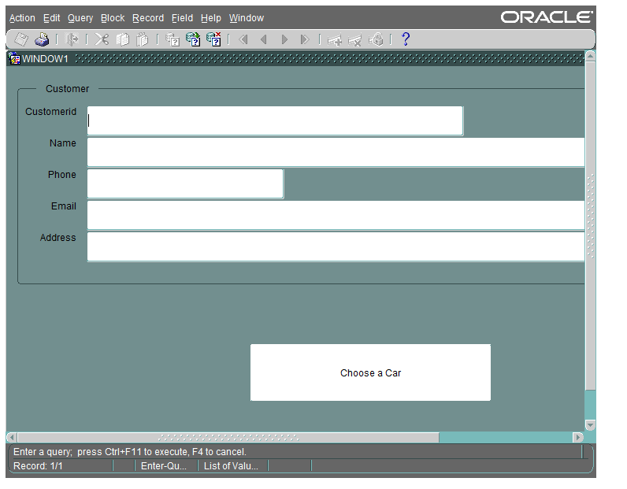

This is a project for my Database universiyt course, it was done as part of a team of 8, I was resposible for building whole UI.

Phase 1 contains: ER Diagrams.
Phase 2 contains: SQL script for the database and scripts used in UI forms.
.fmb file: The UI file for Oracle Forms program.

As requested by course, this project was developed on Oracle Developer & forms 11g

